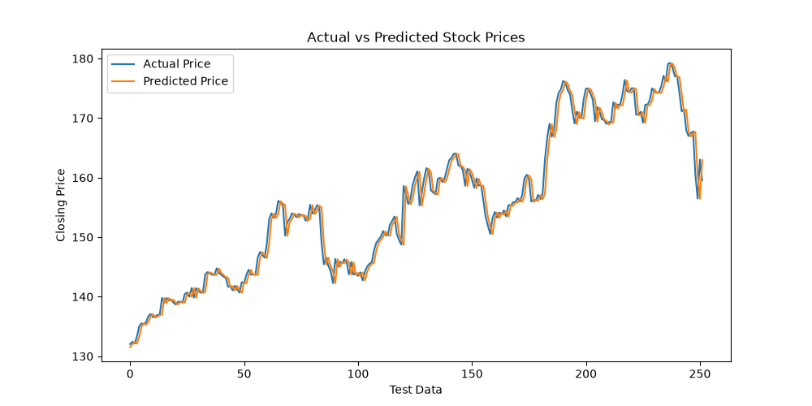

# Stock Price Prediction using Linear Regression

## 📌 Project Overview

This project predicts the closing price of Apple (AAPL) stock using Machine Learning. The project uses historical stock market data and a Linear Regression model to learn the relationship between the previous day's closing price and the current day's closing price.

## 🎯 Objective

The main objective of this project is to build a simple Machine Learning model that can predict stock closing prices using historical stock data.

## 📊 Dataset

The project uses an S&P 500 stock dataset containing historical stock information.

The dataset includes the following columns:

- Date
- Open
- High
- Low
- Close
- Volume
- Name

For this project, Apple (AAPL) stock data was selected.

## 🛠️ Technologies Used

- Python
- Pandas
- NumPy
- Matplotlib
- Scikit-learn
- Linear Regression
- VS Code

## 🔄 Methodology

1. Load the historical stock dataset.
2. Select Apple (AAPL) stock data.
3. Convert the date column into datetime format.
4. Check for missing values.
5. Sort the data chronologically.
6. Create a `previous_close` feature using the previous day's closing price.
7. Split the data into training and testing sets.
8. Train a Linear Regression model.
9. Predict closing prices for the test data.
10. Evaluate the model using MAE, RMSE, and R² Score.
11. Visualize actual and predicted prices.

## 🤖 Machine Learning Model

**Linear Regression** is used to predict the current closing price based on the previous day's closing price.

### Input Feature

`previous_close`

### Target

`close`

## 📈 Model Results

- Training Data: 1006 records
- Testing Data: 252 records
- Mean Absolute Error (MAE): 1.2989
- Root Mean Squared Error (RMSE): 1.8806
- R² Score: 0.9766

The model achieved an R² score of 0.9766 on the test data for this project setup.

## 📉 Actual vs Predicted Prices

The following graph compares the actual stock closing prices with the prices predicted by the Linear Regression model.



## ▶️ How to Run

### 1. Install Python

Make sure Python is installed on your system.

### 2. Install Required Libraries

Open the terminal and run:

```bash
pip install pandas numpy matplotlib scikit-learn
